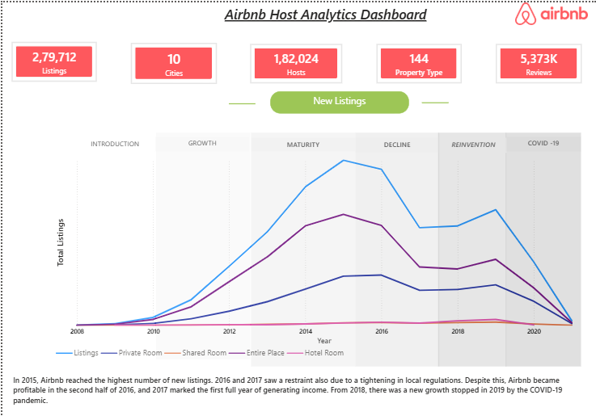
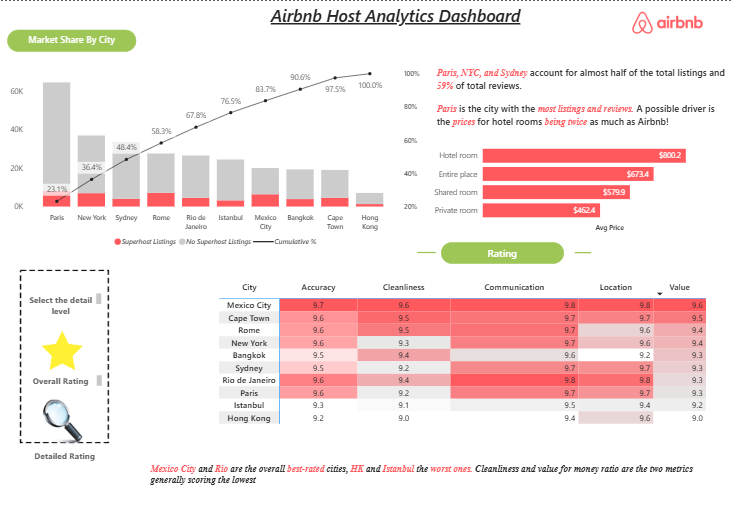
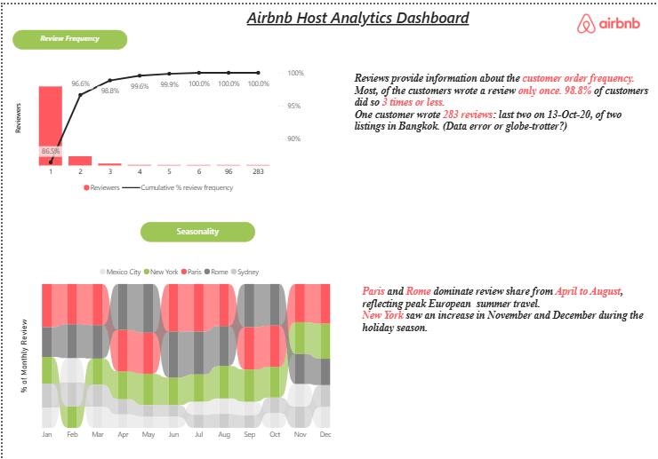

# Global Airbnb Performance Dashboard

An interactive Power BI dashboard analyzing 2,79,712 Airbnb listings across 10 global cities, covering 1,82,024 hosts, 144 property types, and 5.37M reviews.

## Dashboard Preview

**Overview and new listings trend**

**Market share by city, pricing, and ratings**

**Review frequency and seasonality**

## Key Insights
- Paris, New York, and Sydney account for almost half of total listings and 59% of total reviews.
- Paris has the most listings and reviews. Average price is highest for hotel rooms ($800.2), followed by entire places ($673.4), shared rooms ($579.9), and private rooms ($462.4).
- Mexico City and Rio de Janeiro are the best-rated cities overall; Hong Kong and Istanbul are the lowest. Cleanliness and value for money score lowest across cities.
- Paris and Rome dominate review share from April to August, while New York rises in November and December.
- 98.8% of reviewers wrote 3 reviews or fewer.
- New listings peaked in 2015, followed by a slowdown and a sharp drop in 2020 due to COVID-19.

## Tools Used
Power BI | DAX | Data Visualization

## Features
- KPI cards, Pareto (cumulative %) chart, trend and market-share visuals
- Rating heatmap with detail-level toggle
- DAX measures, combo charts, and conditional formatting

